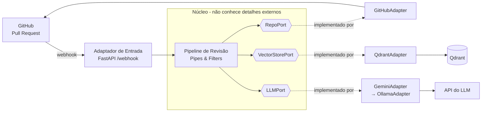
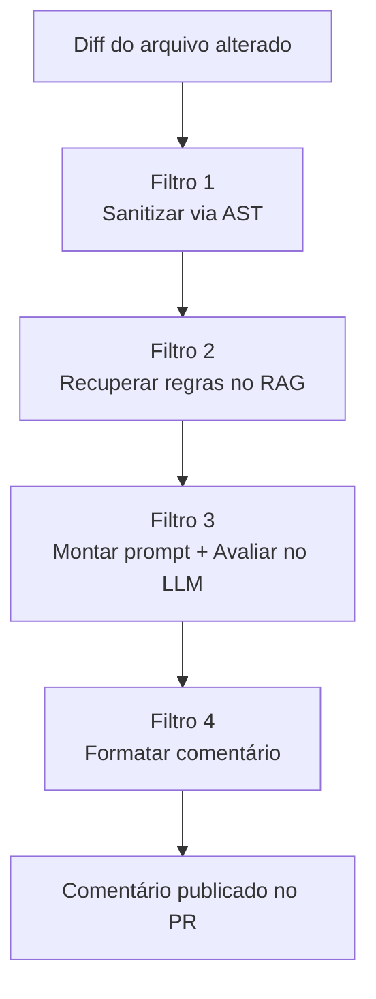

# Arquitetura do Sistema e Cronograma de Desenvolvimento (FDD)

> Documento de planejamento do TCC **"Ferramenta de Apoio à Revisão Arquitetural
> de Pull Requests Baseado em RAG"**. Serve como guia de desenvolvimento e é
> versionado no repositório (princípio GitOps: o repositório é a fonte da verdade).

---

## 1. Decisão Arquitetural

### 1.1. Contexto

O sistema tem duas características que determinam a escolha da arquitetura:

1. **É um fluxo sequencial de processamento**: um Pull Request (PR) entra, passa
   por etapas bem definidas (sanitização estrutural, recuperação de contexto,
   avaliação por LLM) e sai como um comentário. Isso favorece o padrão
   **Pipes & Filters** (Tubos e Filtros).
2. **Depende de serviços externos que devem ser trocáveis**: o LLM começará como
   Gemini e migrará para um modelo open source; o banco vetorial (Qdrant) e a
   plataforma (GitHub) também são detalhes de infraestrutura. Isso favorece o
   padrão **Ports & Adapters** (Hexagonal).

### 1.2. Arquiteturas avaliadas

| Arquitetura | Ideia central | A favor | Contra |
|---|---|---|---|
| Em Camadas (Layered) | Empilha apresentação → aplicação → domínio → infraestrutura | Simples e amplamente documentada | Tende a acoplar o núcleo aos detalhes de infraestrutura |
| **Hexagonal (Ports & Adapters)** | O núcleo define *portas* (interfaces); serviços externos são *adaptadores* plugáveis | Troca de LLM/banco vira troca de adaptador; núcleo testável isoladamente | Mais conceitos a aprender |
| Pipes & Filters | Cada etapa é um *filtro* com entrada/saída padronizada | Espelha literalmente o fluxo do sistema; cada etapa testável | Sozinha não organiza as integrações externas |

### 1.3. Decisão: Hexagonal + Pipes & Filters no núcleo

As duas abordagens **se complementam**:

- **Hexagonal** organiza as *fronteiras*. GitHub, Qdrant e LLM tornam-se **portas**
  (interfaces) com **adaptadores** concretos. Trocar `GeminiAdapter` por
  `OllamaAdapter` não altera nenhuma linha do núcleo.
- **Pipes & Filters** organiza o *miolo*. O pipeline de revisão é uma sequência de
  filtros isolados e testáveis.

**Justificativa para o TCC:**

1. **Testabilidade** — o núcleo é testado com *mocks* das portas, sem chamar
   GitHub/Gemini reais. Sustenta a "validação contínua" que o FDD exige.
2. **Aderência ao documento** — a troca de LLM deixa de ser uma promessa e passa a
   ser uma *propriedade arquitetural demonstrável*.
3. **Rastreabilidade FDD** — cada funcionalidade da lista mapeia para um módulo.

### 1.4. Diagrama da arquitetura



### 1.5. O pipeline interno (Pipes & Filters)



### 1.6. Estrutura de pastas alvo

```
baseline-core-system/
├── app/
│   ├── api/                  # adaptador de ENTRADA (FastAPI, rota /webhook)
│   │   └── webhook.py
│   ├── core/                 # o NÚCLEO (independente de GitHub/Gemini/Qdrant)
│   │   ├── pipeline.py       #   o fluxo (Pipes & Filters)
│   │   ├── ports.py          #   interfaces: RepoPort, VectorStorePort, LLMPort
│   │   └── models.py         #   estruturas de dados do domínio
│   ├── adapters/             # implementações plugáveis das portas
│   │   ├── github_adapter.py
│   │   ├── gemini_adapter.py #   (futuramente: ollama_adapter.py)
│   │   └── qdrant_adapter.py
│   ├── services/             # peças técnicas de apoio
│   │   ├── ast_service.py    #   sanitização estrutural
│   │   └── embeddings.py     #   geração de vetores
│   └── config.py             # configuração central (já existe)
├── docs/                     # planejamento e documentação (este arquivo)
├── tests/                    # testes automatizados por filtro/adaptador
├── main.py                   # ponto de entrada (sobe o servidor)
└── requirements.txt
```

> **Versão pragmática:** começaremos com esta separação de forma leve (sem
> abstração excessiva) e refinaremos conforme as funcionalidades exigirem.

---

## 2. Lista de Funcionalidades (FDD — Processo 2)

No FDD, uma funcionalidade é descrita na gramática **`<ação> <resultado> <objeto>`**
e agrupada em **Conjuntos de Funcionalidades**. Cada conjunto abaixo mapeia para
uma parte da arquitetura.

### Conjunto A — Integração com o GitHub *(entrada e saída do sistema)*
- **A1** — Receber um evento de Pull Request via webhook
- **A2** — Extrair os arquivos alterados de um Pull Request
- **A3** — Publicar um comentário de feedback em um Pull Request

> *Já existe um protótipo funcional destas três; serão refatoradas para dentro da
> arquitetura como o `GitHubAdapter`.*

### Conjunto B — Sanitização Estrutural (AST)
- **B1** — Identificar a linguagem de um arquivo alterado
- **B2** — Extrair o esqueleto lógico de um arquivo Python via AST
- **B3** — Isolar apenas os elementos alterados no diff

> *Escopo: foco em Python (biblioteca `ast` nativa). Outras linguagens exigiriam
> `tree-sitter` — decisão de escopo a registrar no TCC.*

### Conjunto C — Base de Conhecimento e RAG
- **C1** — Carregar o documento SDD da organização
- **C2** — Fragmentar (chunking) o SDD em unidades de regra
- **C3** — Gerar embeddings dos fragmentos
- **C4** — Armazenar os embeddings no Qdrant
- **C5** — Recuperar as regras relevantes para um trecho de código

### Conjunto D — Motor de Avaliação (LLM)
- **D1** — Montar o prompt combinando código sanitizado e regras recuperadas
- **D2** — Avaliar o código com o LLM (através da `LLMPort`)
- **D3** — Formatar a resposta da IA como comentário de PR

### Conjunto E — Orquestração e Autonomia (CI/CD)
- **E1** — Orquestrar o pipeline completo (encadear os filtros)
- **E2** — Tratar erros e casos de borda de forma resiliente
- **E3** — Disponibilizar o serviço para o GitHub (exposição/deploy)

### Conjunto F — Qualidade *(transversal, contínuo)*
- **F1** — Escrever testes automatizados por filtro e adaptador
- **F2** — Registrar logs e mensagens de execução (observabilidade)
- **F3** — Manter a documentação do projeto atualizada

---

## 3. Cronograma (FDD — Processos 3, 4 e 5)

Premissas: entrega em **~2 a 3 meses**, dedicação de **10–20 h/semana**.
Plano em **12 semanas**, com folga ao final para experimentos e escrita do TCC.

Cada conjunto de funcionalidades passa pelo ciclo FDD:
**Planejar → Detalhar (Design by Feature) → Construir (Build by Feature)**.

| Semana | Fase FDD | Foco | Entregável |
|---|---|---|---|
| **1** | P1 + P2 | **Modelo Geral + Lista de Funcionalidades.** Fechar arquitetura, criar esqueleto de pastas e as portas (interfaces vazias). | Estrutura `app/` + `ports.py` definido |
| **2** | Conjunto A | Refatorar o protótipo do GitHub para dentro da arquitetura (`GitHubAdapter` + rota em `api/`). | Recebe webhook e publica comentário, já na arquitetura nova |
| **3–4** | Conjunto B | **Sanitização AST.** Extrair esqueleto lógico e isolar o que mudou. | `ast_service` funcional + testes |
| **5–7** | Conjunto C | **RAG/Qdrant** (a maior peça). Subir Qdrant, ingerir o SDD, chunking, embeddings, recuperação. | Busca semântica de regras funcionando + testes |
| **8–9** | Conjunto D | **Motor LLM.** Engenharia de prompt, `LLMPort` + `GeminiAdapter`, formatação da resposta. | Avaliação gerando feedback coerente + testes |
| **10** | Conjunto E | **Orquestração fim-a-fim**, tratamento de erros, exposição do serviço (ngrok/nuvem). | Pipeline completo rodando de ponta a ponta |
| **11** | Integração | Testes de integração, **experimentos e métricas** (precisão, falsos positivos, tempo de revisão). | Dados para o capítulo de Resultados |
| **12** | Buffer | Ajustes finais + escrita dos capítulos de Desenvolvimento e Resultados. | TCC atualizado |

> O **Conjunto F (Qualidade)** não tem uma semana própria: roda em paralelo a
> todas as semanas — cada funcionalidade só é considerada "pronta" com teste e log.

### Definição de Pronto (Definition of Done) por funcionalidade
Uma funcionalidade só é dada como concluída quando:
1. O código está implementado e você **entende cada linha e o porquê dela**;
2. Existe pelo menos um teste automatizado cobrindo o caminho principal;
3. Erros previsíveis são tratados;
4. A documentação/comentários relevantes foram atualizados.

---

## 4. Próximo passo imediato

**Semana 1 — FDD Processo 1 (Desenvolver o Modelo Geral):** criar o esqueleto de
pastas `app/` e escrever as **portas** (`core/ports.py`) — as interfaces que o
núcleo vai depender. Nenhuma lógica ainda, apenas os contratos. É o alicerce que
torna todo o resto plugável e testável.
